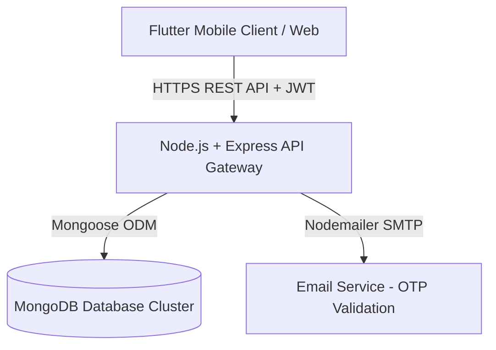

# 🏬 Sree Ram Dyes & Chemicals (SRDC) — Multi-Branch Inventory Suite

[](https://flutter.dev)
[](https://nodejs.org)
[](https://expressjs.com)
[](https://www.mongodb.com)
[](#)

A state-of-the-art **Multi-Branch Inventory & Business Management Suite** custom-engineered for **Sree Ram Dyes & Chemicals (SRDC)**. Established in 1992 by **Mr. C. Sharavanan** in Tirupur, Tamil Nadu, SRDC has been a trusted pioneer in importing and trading premium textile-grade screen printing inks, dyes, and chemicals. 

This enterprise-grade system bridges the physical-digital gap, allowing seamless stock auditing, branch coordination, staff logs, and supplier tracking across multiple commercial branches (e.g., *Sree Ram Main* and *Ramraj Branch*).

---

## 🎨 Premium Visual System & Design Aesthetics

Designed with a high-fidelity aesthetic, the frontend Flutter application delivers a luxury user experience:
*   **Dual-Theme Engine (Dynamic Dark & Light Mode)**: Fully integrated custom system with smooth state-toggled animations using `ThemeProvider`.
*   **Glassmorphic Design & Ambient Glows**: Utilizes radial warm gradients (top-left red glow, bottom-right violet glow, and top-right light-blue glow) to create an organic, premium visual experience.
*   **Responsive Micro-Animations**: Features custom animated progress bars, glowing sweep-gradient outer rings for the logo, and tap-responsive card widgets.
*   **Harmonious Color Palette**: Built on sophisticated design tokens (warm amber, orange, electric blue, forest green, deep crimson, and rich carbon surface colors).

---

## 🛠️ Architecture Overview

The system utilizes a secure, distributed **Client-Server Architecture**:



### Key Technical Attributes
1.  **JWT Authentication Service**: Bearer token standard validates every client request with automatic client-side persistence via `shared_preferences`.
2.  **Role-Based Access Control (RBAC)**: Enforces access bounds (Admin vs. Staff vs. Public Guest) on both frontend screens and backend endpoints.
3.  **Automatic DB Seeding**: Seeds the database with default branch entities, unit variables, and a default root administrator account on first boot.

---

## 👥 Role-Based Workflows & Access Privileges

| Module / Feature | Public / Guest | Staff / User | Administrator |
| :--- | :---: | :---: | :---: |
| **Splash / Welcome Screen** | Read | Read | Read |
| **Branch Information Directory** | Read | Read | Read |
| **Public Products Directory** | Read (Optional) | Read | Full Access |
| **Public Contacts Directory** | Read (Optional) | Read (Only) | Full Access |
| **Stock Balance Sheet** | ❌ | Read | Full Access |
| **Transaction Recording** | ❌ | Create | Full Access |
| **Stock Adjustments / Audits** | ❌ | Create | Full Access |
| **Low Stock Warnings** | ❌ | Read | Full Access |
| **Vendor Directory** | ❌ | ❌ | Full Access |
| **Admin Configuration Dashboard** | ❌ | ❌ | Full Access |
| **Staff Registration & Status Toggles** | ❌ | ❌ | Full Access |
| **Security Credentials Recovery (OTP)** | ❌ | ❌ | Full Access |

---

## 📱 Interactive Screen-by-Screen Features

### 1. 🔐 Security & Authentication Suite (`login_page.dart`, `main.dart`)
*   **Seamless Login/Registration Forms**: Separate, glowing login entry points for staff accounts and admin systems.
*   **Dynamic Change Password Dialog**: Allows direct change of password from the dashboard utilizing clean, masked input fields.
*   **Advanced Forgot Password OTP flow**:
    *   Sends a One-Time Password (OTP) to the secure business email registered for the main branch.
    *   Features a **2-Minute Live Countdown Timer** in the app.
    *   Implements an **Automatic Session Expiry** mechanic. Once expired, the OTP is invalidated server-side to block brute-force attempts.

### 2. 📦 Product Management System (`product_page.dart`, `product_list_page.dart`)
*   **Extensive Product Cards**: Beautiful layouts displaying the product image, unique item code, category tag, brand, vendor details, and active status.
*   **Smart Catalog Filters**: Real-time filtering by category (e.g., *PLASTISOL, SILICONE, W/B, SPECIAL INKS*), active status (Active/Inactive), vendor, and full text search matching name, brand, or code.
*   **Dynamic Custom Unit Creation**: Searchable dropdowns for unit inputs (e.g., *kg, box, piece, box, dozen, liter*). Admin users can add a new unit directly inside the form, updating the database in real-time.
*   **Camera & Gallery Integration**: High-compression image upload tool which automatically compresses files to stay **under the 2MB threshold** to guarantee speedy server synchronization.
*   **Bulk Operations Panel**: Multi-selection mode allowing administrators to apply actions to multiple products at once (e.g., bulk category shifts, bulk status toggles, or bulk deletions).

### 3. 📊 Stock Management & Low-Stock Alerts (`stock_page.dart`)
*   **Live Stock Balances**: Lists item quantities mapped by branch, complete with beautiful visual status rings.
*   **Custom Alert Thresholds**: Allows custom `minLevel` definitions per product/branch combination.
*   **Stock Alert Warnings**: Real-time background notifications and visual banners when an item's stock dips below the designated minimum level.

### 4. 🔄 Transaction Ledger (`stock_page.dart`)
Users and admins can execute four primary transaction types, logging timestamps and notes for audit trails:
1.  **Add Stock (Purchase)**: Restocks inventory levels at the active branch.
2.  **Reduce Stock (Sale)**: Deducts stock levels following a successful sale.
3.  **Stock Transfer**: Moves inventory between branches. Displays selection dropdowns for *From* and *To* branches, and prevents same-branch transfers.
4.  **Stock Adjustment (Audit)**: Deducts inventory for damaged, expired, or lost items, requiring a choice of reason and additional auditing comments.

### 5. 🏢 Branch Configuration (`branch_management_page.dart`, `branch_selection_page.dart`)
*   Designate a branch as the **Main Branch** (which receives secure email alerts and password resets) or general branches.
*   Add, edit, or delete branch metadata, including physical addresses, business hours, contact numbers, and support emails.

### 6. 🤝 Vendor Management System (`vendor_management_page.dart`)
*   Provides centralized profiles for supplier networks.
*   Track name, unique supplier code, key contact person, phone number, email, and address.
*   Link products directly to vendor profiles to streamline reordering.

### 7. 👥 Staff Management Panel (`user_management_page.dart`)
*   Allows administrators to monitor registered staff accounts.
*   Features active/inactive toggles to easily approve new hires or deactivate former employees.
*   Provides secure, admin-authorized **User Password Reveals** and direct password resets to help staff who have forgotten their credentials.

### 8. 📝 Audits and Logs (`login_history_page.dart`)
*   Maintains a timestamped audit log of all account logins.
*   Logs user roles, username, and timestamps for transparent security tracking.

### 9. 📞 Contacts Directory (`contact_page.dart`, `public_contacts_page.dart`)
*   A categorized contact repository containing four distinct tabs: **Management**, **Staff**, **Transport**, and **Services**.
*   Tap-to-call and tap-to-email integration for quick communication.

---

## ⚙️ Backend REST API Endpoints (`backend/`)

The API is fully structured, protected by JWT middleware, and responds with standardized JSON outputs:

### 🔑 Authentication (`/api/auth`)
*   `POST /api/auth/admin/login` - Admin login credentials validation.
*   `POST /api/auth/admin/forgot-password` - Dispatches password reset OTP.
*   `POST /api/auth/admin/reset-password-otp` - Resets admin password using valid OTP.
*   `POST /api/auth/admin/change-password` - Direct admin password update.
*   `POST /api/auth/user/signup` - Registers a new staff account (starts inactive).
*   `POST /api/auth/user/login` - Staff member login credentials validation.
*   `GET /api/auth/users` - Fetch user registry (*Admin only*).
*   `PUT /api/auth/users/:id/toggle` - Activate/Deactivate staff profile (*Admin only*).
*   `POST /api/auth/users/:id/reveal` - Reveals a user's password (*Admin only*).
*   `DELETE /api/auth/users/:id` - Deletes a user profile (*Admin only*).

### 📦 Products (`/api/products`)
*   `GET /api/products` - Returns products. Supports filters like `?category=...` and `?branch=...`.
*   `POST /api/products` - Create product (*Admin only*, supports multipart image uploads).
*   `PUT /api/products/:id` - Edit product (*Admin only*, supports multipart image updates).
*   `PATCH /api/products/:id/toggle` - Toggles product active/inactive state.
*   `DELETE /api/products/:id` - Deletes a product (*Admin only*).
*   `GET /api/products/list/all-shops` - Returns comprehensive stock matrices across all branches.

### 🏭 Stock & Ledger (`/api/stock`)
*   `GET /api/stock` - Retrieve active stock balances. Supports `?branch=...` query.
*   `GET /api/stock/alerts` - Fetch low-stock alert products.
*   `PUT /api/stock/:id/minlevel` - Update target product `minLevel` constraint.
*   `DELETE /api/stock/:id` - Remove stock item entry (*Admin only*).
*   `GET /api/stock/transactions/all` - List historical transactions. Supports `?type=...` and `?branch=...` queries.
*   `POST /api/stock/transactions` - Logs a new transaction and updates stock levels.

---

## 🚀 Setup & Installation Instructions

### 1. Backend Server Setup
1.  Navigate to the backend directory:
    ```bash
    cd backend
    ```
2.  Install dependencies:
    ```bash
    npm install
    ```
3.  Configure your environment variables in a `.env` file in the root backend directory:
    ```env
    PORT=5000
    MONGO_URI=mongodb://localhost:27017/sreeram_db
    JWT_SECRET=SreeRam_Super_Secret_Key_2026!
    
    # SMTP Configuration (For OTP mail services)
    SMTP_HOST=smtp.gmail.com
    SMTP_PORT=587
    SMTP_USER=your-business-email@gmail.com
    SMTP_PASS=your-app-password
    
    # Default Admin (Seeded on first startup)
    ADMIN_USERNAME=Sreeram
    ADMIN_PASSWORD=Sree@123
    ```
4.  Start the backend server:
    ```bash
    # For development (with nodemon auto-restart)
    npm run dev
    
    # For production
    npm start
    ```
    *Note: The backend seeds the database on first boot. The default administrator login will be `Sreeram` with password `Sree@123`.*

### 2. Frontend Flutter App Setup
1.  Ensure you have the Flutter SDK installed (`sdk: ^3.11.0` or higher).
2.  Navigate to the project root:
    ```bash
    cd flutter_v3
    ```
3.  Install dependencies:
    ```bash
    flutter pub get
    ```
4.  Configure the backend address in `lib/services/api_service.dart`:
    *   **Android Emulator**: Set to `http://10.0.2.2:5000/api`
    *   **Flutter Web / Local Chrome**: Set to `http://localhost:5000/api`
    *   **Physical Mobile (on same WiFi)**: Set to `http://YOUR_PC_IP:5000/api`
    *   **Production Release**: Update `_prodUrl` to your deployed HTTPS server address.
5.  Run the application:
    ```bash
    flutter run
    ```
6.  To build native assets:
    *   **Android APK**: `flutter build apk --release`
    *   **Web Production Bundle**: `flutter build web --release`

---

*Built with passion for Sree Ram Dyes & Chemicals — Quality • Trust • Service*
